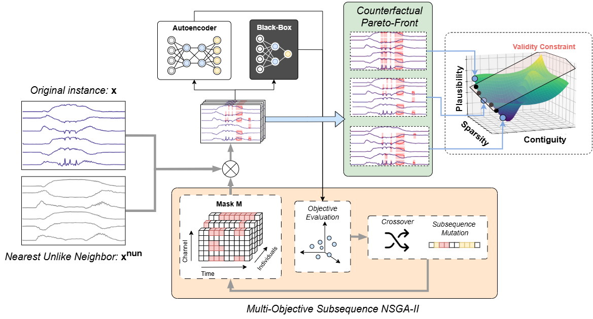

# Multi-SpaCE
This repository contains the code of "Multi-SpaCE: Multi-Objective Subsequence-based Sparse Counterfactual Explanations for Multivariate Time Series Classification".

Multi-SpaCE extends our previous work, [Sub-SpaCE](https://github.com/MarioRefoyo/Sub-SpaCE), that uses a genetic algorithm (GA) with custom mutation
and initialization to generate counterfactual explanations by optimizing sparsity, plausibility and minimizing the number of subsequences. 
Multi-SpaCE inherits all the good properties of Sub-SpaCE (such as its model-agnostic nature, its computational efficiency 
or the validity of all the generated CFEs), while overcoming its two major limitations: its restriction to univariate data and its
reliance on extensive experimentation to balance multiple desiderata. By introducing a multi-objective optimization framework based
on Non-Dominated Sorting Genetic Algorithm II (NSGA-II), Multi-SpaCE offers a Pareto-Front of solutions, enabling users to explore 
trade-offs between objectives. The optimization task identifies the points in the original input to modify, substituting their values with 
those of the Nearest Unlike Neighbor (NUN).

# Source Code
The source code of Multi-SubSpaCE can be found in `./methods/MultiSubSpaCECF.py`. The class within this file extends
`CounterfactualMethod` in `./methods/counterfactual_common.py`, a wrapper class to normalize the interfaces of all methods
included in the experiments. Additionally, `MultiSubSpaCECF.py` utilizes auxiliary classes like 
`SubsequencePruningEvolutionaryOptimizer` containing the source code of the method, which can be found under `./methods/SubSpaCE/*`.

# Experiments
To reproduce the experiments, train the black-box classifiers and Outlier Detection models by running 
`./experiments/models/train_classification_model.py`,  `./experiments/models/train_ae_model.py`, `./experiments/models/train_if_model.py` 
and `./experiments/models/train_lof_model.py`. This will create a folder per dataset in `./experiments/models/` containing the models and the parameters.

Then, run `./experiments/ab-cf.py`, `./experiments/comte.py`, `./experiments/discox.py`, `./experiments/glacier.py`, `./experiments/ng.py` to 
obtain the results of the baseline methods, and `./experiments/multispace.py` to obtain the results of Multi-SpaCE. 
Counterfactual Explanations will be stored in `./experiments/results/{DATASET}/{EXPERIMENT_NAME}` using pickle format.

To visualize results tables, execute `./experiments/evaluation/visualize_counterfactuals_mo_multivariate.ipynb`
